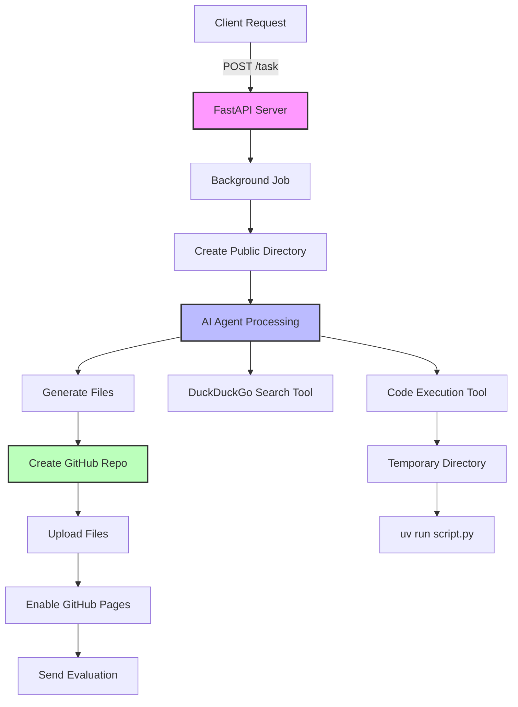
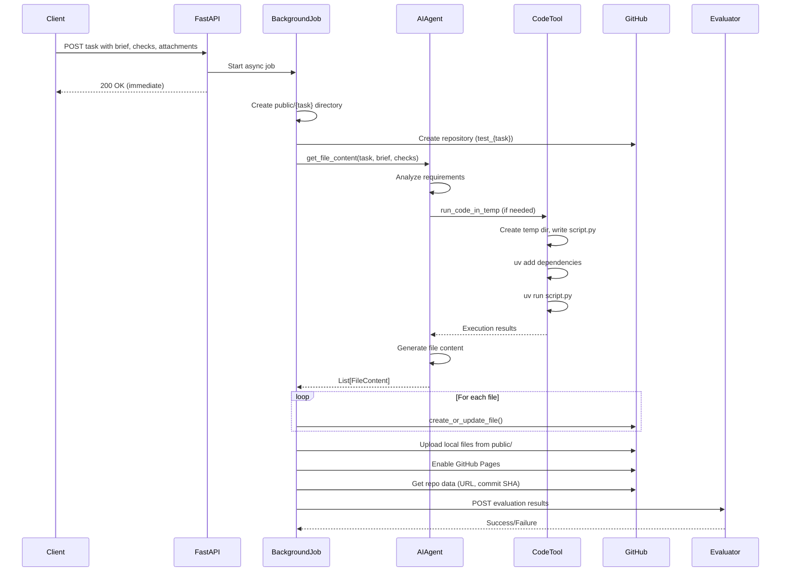
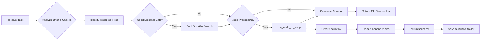
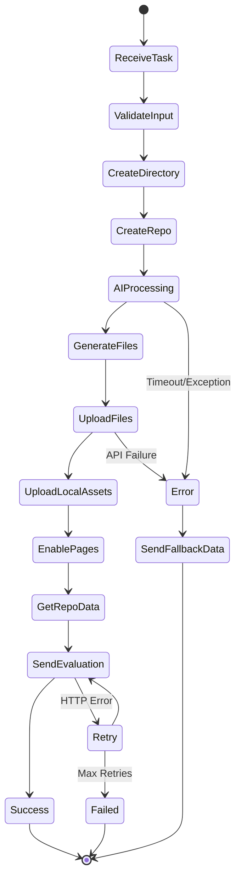

# GitHub Application Builder

An automated system that generates and deploys static websites to GitHub Pages using AI-powered content generation with **Pydantic AI agents**.[^3][^1]

## Overview

This application receives task requests via a FastAPI endpoint, uses AI agents to generate required files (HTML, JSON, SVG, etc.), creates a GitHub repository, and deploys the content to GitHub Pages.[^2][^3]

## Architecture




## Project Structure

```
github_application_builder/
├── src/
│   ├── main.py              # FastAPI app & background job orchestration
│   ├── ai/
│   │   └── agent.py         # Pydantic AI agent for file generation
│   └── core/
│       ├── github.py        # GitHub API operations
│       ├── model.py         # Pydantic models
│       ├── logger.py        # Logging configuration
│       └── send_eval.py     # Evaluation submission with retry
├── public/                  # Generated static files per task
├── logs/                    # Application logs (debug.log, info.log)
├── tests/                   # Test files and JSON task definitions
└── requirements.txt         # Python dependencies
```


## Workflow Diagram




## Key Components

### 1. FastAPI Server (`main.py`)

The entry point that handles incoming task requests and manages background job execution.[^3]

**Endpoints:**

- `GET /` - Health check
- `POST /task` - Receives task requests and triggers background processing

**Environment Variables Required:**

- `AIMODEL_NAME` - AI model identifier (e.g., "openai:gpt-4")
- `GITHUB_ACCESS_TOKEN` - GitHub personal access token
- `GFORM_SECRET` - Secret for form validation


### 2. AI Agent (`agent.py`)

Powered by Pydantic AI, the agent generates static website files based on task requirements.[^1]

**Tools Available:**

- **DuckDuckGo Search** - Web search for information gathering (max 1 call)
- **Code Execution Tool** - Runs Python scripts in isolated environments (max 4 calls)

**Process Flow:**



**Code Execution Tool Workflow:**

1. Creates temporary directory[^1]
2. Writes Python code to `script.py`
3. Extracts attachments (handles base64 data URIs)
4. Adds dependencies using `uv add --script`
5. Executes script using `uv run`
6. Returns stdout/stderr and file list

### 3. GitHub Operations (`github.py`)

Handles all GitHub API interactions.[^2]

**Functions:**

- `create_new_repo()` - Creates public repository with auto-init
- `enable_github_pages()` - Configures GitHub Pages from main branch
- `create_or_update_file()` - Uploads/updates individual files
- `uploade_all_public_file_from_local_directory()` - Batch uploads from local directory
- `get_all_files_url()` - Retrieves download URLs for all files
- `get_output_data()` - Returns repo URL, commit SHA, and Pages URL


### 4. Data Models (`model.py`)

Pydantic models for type safety and validation.[^5]

```python
class Attachment(BaseModel):
    name: str           # Filename
    url: str            # Data URI (base64 encoded)

class ClientTask(BaseModel):
    email: EmailStr
    secret: str
    task: str
    round: int
    evaluation_url: AnyUrl
    nonce: Optional[str]
    brief: Optional[str]
    checks: Optional[List[str] | str]
    attachments: Optional[List[Attachment]]

class FileContent(BaseModel):
    path: str          # File path in repo
    content: str       # File content
    commit_message: str
```


### 5. Evaluation Submission (`send_eval.py`)

Submits results to evaluation endpoint with retry logic.[^4]

**Features:**

- Exponential backoff (1s, 2s, 4s, 8s, 16s)
- Max 5 retry attempts
- 30-second timeout per request
- Comprehensive error logging


### 6. Logger (`logger.py`)

Dual logging system with IST timezone.[^6]

**Log Levels:**

- `debug.log` - All debug and info messages
- `info.log` - Info level and above
- Console - Info level and above


## Task Processing Flow




## Example Request

```json
{
  "email": "user@example.com",
  "secret": "s",
  "task": "LLMPages",
  "round": 1,
  "evaluation_url": "http://localhost:8787/evaluate",
  "nonce": "019a252d-a236-748a-836e-afd11f49bc4b",
  "brief": "Create files for GitHub Pages...",
  "checks": [
    "Each required file exists on GitHub",
    "index.html links to all required assets",
    "pelican.svg is valid SVG"
  ],
  "attachments": [
    {
      "name": "uid.txt",
      "url": "data:text/plain;base64,MTAyNDU..."
    }
  ]
}
```


## Generated Output Structure

For a task named "LLMPages", the system generates:

```
public/LLMPages/
├── index.html       # Main page with links
├── README.md        # Project documentation
├── pelican.svg      # Generated SVG image
├── ashravan.txt     # Story content
├── dilemma.json     # Decision data
├── about.md         # Description
├── restaurant.json  # Restaurant data
├── prediction.json  # Forecast data
├── LICENSE          # MIT License
└── uid.txt          # Uploaded attachment
```

All files are uploaded to `https://github.com/{user}/test_LLMPages` and deployed to `https://{user}.github.io/test_LLMPages/`.[^2]

## Error Handling

The system includes comprehensive error handling at multiple levels:[^4][^3]

1. **Task Timeout** - 9-minute timeout with fallback data
2. **API Failures** - Retry logic with exponential backoff
3. **File Generation** - Graceful degradation to fallback URLs
4. **Logging** - All errors logged with full stack traces

## Setup

1. Install dependencies:
```bash
pip install -r requirements.txt
```

2. Set environment variables:
```bash
export AIMODEL_NAME="openai:gpt-4"
export GITHUB_ACCESS_TOKEN="ghp_xxxx"
export GFORM_SECRET="your_secret"
```

3. Run the server:
```bash
uvicorn src.main:app --reload
```


## Technologies Used

- **FastAPI** - Web framework with async support[^3]
- **Pydantic AI** - AI agent framework with tool calling[^1]
- **PyGithub** - GitHub API wrapper[^2]
- **httpx** - Async HTTP client[^4]
- **uv** - Fast Python package installer and runner[^1]


## License

MIT License

***

**Note**: This system is designed for automated GitHub Pages deployment with AI-generated content, suitable for educational platforms and task evaluation systems.[^3]

